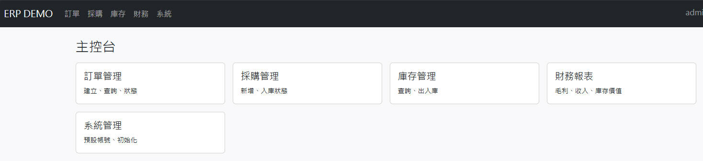

# VibeCodingERP
Vibe Coding ERP



## 快速開始

1) 安裝相依

```bash
pip install -r requirements.txt
```

2) 啟動應用

```bash
python app.py
```

3) 在瀏覽器開啟 `http://127.0.0.1:5000/login`

- 可用帳號：`admin`、`buyer`、`warehouse`、`finance`（無需密碼）

## 目前進度（對應 PRD）
- 登入頁、主控台、各模組頁框架已建立（以 session 模擬登入）。
- 採購/訂單/庫存/財務功能將逐步補齊：
  - 採購：新增採購單、入庫流程
  - 訂單：新增訂單、出貨流程
  - 庫存：查詢、入/出庫、即時報表
  - 財務：收入、成本、庫存價值、毛利

